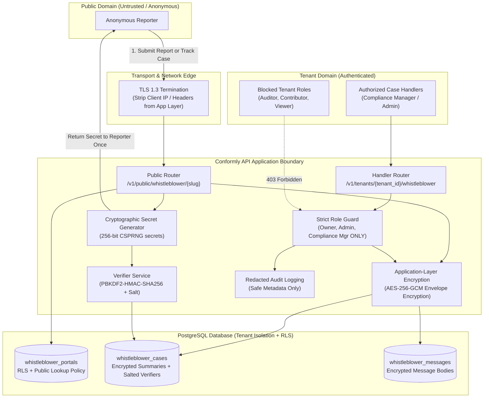
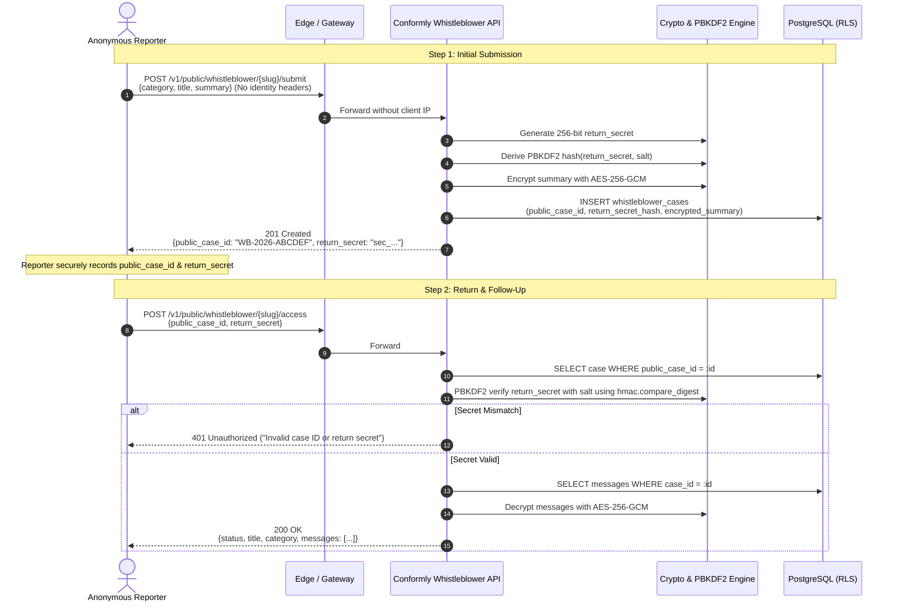

# Whistleblower Module — Threat Model & Privacy Architecture

This document defines the threat model, trust boundaries, data flows, attack vectors, and cryptographic mitigations for Conformly's anonymous whistleblower module, in strict compliance with `AGENTS.md` and `docs/SECURITY.md`.

---

## 1. Trust Boundaries & Architecture Overview

The Whistleblower module establishes a strict privacy boundary between the external public domain (anonymous reporters) and the authenticated tenant domain (compliance officers / case handlers).

---

## 2. Threat Actors & Capabilities

| Threat Actor | Motivation & Capabilities | Primary Target |
| :--- | :--- | :--- |
| **Malicious Insider / Rogue Employee** | Possesses standard tenant credentials (e.g. Viewer, Contributor, Auditor). Wants to uncover who blew the whistle or read sensitive accusations. | Case details, message contents, reporter identity markers. |
| **Network Eavesdropper / ISP** | Observes traffic in transit between reporter and Conformly edge. | Deanonymization of reporter via headers, metadata, or unencrypted payloads. |
| **External Attacker / Script Kiddie** | Brute-forces public case access endpoints; attempts credential stuffing, timing attacks, or injection. | Unauthorized case access, case tampering, service disruption. |
| **Hostile Target Named in Report** | High-privilege tenant actor (e.g. executive) named in an investigation seeking to track down the reporter or destroy evidence. | Reporter access logs, audit logs, backup dumps, return secret recovery. |
| **Malicious Reporter / Spammer** | Submits garbage cases, spam, or oversized payloads to exhaust storage or handler capacity. | Platform availability, storage quota, handler attention. |

---

## 3. Attack Vectors & Safeguards

### 3.1 Deanonymization of Anonymous Reporters
* **Threat**: Reconstructing the identity of an anonymous reporter through client IP addresses, browser user-agents, session cookies, tracking identifiers, or correlation with other tenant actions.
* **Safeguards**:
  - **Zero Identity Persistence**: The API layer deliberately ignores, redacts, and drops `Remote-Addr`, `X-Forwarded-For`, and `User-Agent` headers. No IP addresses or hardware fingerprints are written to database tables, logs, or audit records.
  - **No Session Cookies or OIDC**: The public reporting interface does not establish sessions, set cookies, or require OpenID Connect authentication.
  - **No Identity Reconstruction Mechanism**: Conformly strictly prohibits the creation of any administrative backdoor, correlation algorithm, or heuristic intended to deanonymize reporters (`AGENTS.md`).

### 3.2 Return Secret Compromise & Brute Force
* **Threat**: An attacker guesses or extracts the return secret used by a reporter to track a case, allowing the attacker to read handler replies or impersonate the reporter.
* **Safeguards**:
  - **256-Bit Cryptographic Entropy**: Return secrets are generated using Python's `secrets.token_urlsafe(32)` (256 bits of CSPRNG entropy).
  - **One-Way Salted Verifier (PBKDF2-HMAC-SHA256)**: Plaintext return secrets are **never** stored in database columns. The database stores only a random 16-byte salt and the PBKDF2 derivative (100,000 iterations).
  - **Constant-Time Verification**: Verification of return secrets uses `hmac.compare_digest` to prevent timing side-channel attacks.
  - **One-Time Display**: The plaintext secret is delivered to the reporter once in the submission response and cannot be recovered by any administrator or support agent if lost.

### 3.3 Eavesdropping on Case Details & Messages
* **Threat**: A database administrator, cloud provider snapshot leak, or backup compromise exposes sensitive allegations and whistleblower testimony.
* **Safeguards**:
  - **Application-Layer Envelope Encryption (AES-256-GCM)**: All case summaries and message bodies are encrypted at the application layer via `EncryptedFieldCodec` before SQL persistence.
  - **Tenant-Specific Data Encryption Keys**: Cryptographic operations use tenant DEKs wrapped by master key encryption keys (KEKs), isolating data at rest even if raw table rows are exfiltrated.

### 3.4 Insider Snooping via Tenant Role Escalation
* **Threat**: Tenant members with read access (e.g. general Auditors, Contributors, or Viewers) view confidential whistleblower reports.
* **Safeguards**:
  - **Strict Capability Gating**: Whistleblower operations require dedicated capabilities:
    - `whistleblower:portal_manage`
    - `whistleblower:case_read`
    - `whistleblower:case_manage`
  - **Role Allowlist**: These capabilities are granted exclusively to `TenantRole.OWNER`, `TenantRole.ADMINISTRATOR`, and `TenantRole.COMPLIANCE_MANAGER`. All other roles (`AUDITOR`, `CONTRIBUTOR`, `VIEWER`) are denied with HTTP 403.
  - **Audit Trails**: Every handler access to a case is logged with the handler's user ID and timestamp in the tamper-evident audit log.

### 3.5 Leakage Through Audit Logs & Structured Telemetry
* **Threat**: Sensitive report contents or return secrets inadvertently appear in application logs, APM traces, or structured audit metadata.
* **Safeguards**:
  - **Strict Metadata Allowlisting**: The `AuditService` validates all event metadata against a strict schema. Only safe operational keys (`portal_id`, `case_id`, `public_case_id`, `category`, `case_status`, `handler_user_id`, `sender_type`) are permitted.
  - Return secrets, secret hashes, message text, and network identifiers are rejected by schema assertion.

### 3.6 Cross-Tenant Case Access & Tampering
* **Threat**: An authenticated handler from Tenant A crafts an API request to view or modify whistleblower cases belonging to Tenant B.
* **Safeguards**:
  - **Dual-Layer Isolation**:
    1. **Server-Side Query Scoping**: Every handler SQL query explicitly filters by `tenant_id == current_tenant.id`.
    2. **PostgreSQL Row Level Security (RLS)**: PostgreSQL enforces `FORCE ROW LEVEL SECURITY` across all whistleblower tables (`whistleblower_portals`, `whistleblower_cases`, `whistleblower_messages`, `whistleblower_attachments`, `whistleblower_case_assignments`).
  - Public portal lookup allows reading active portal configuration by `slug` without disclosing tenant details or case contents.

---

## 4. Anonymous Reporter Return Protocol

---

## 5. Security Invariants Checklist

1. [x] Plaintext return secrets are **never** persisted to any database or storage.
2. [x] Return secret verifiers use salted PBKDF2-HMAC-SHA256 with 100,000 iterations.
3. [x] Secret comparisons use constant-time `hmac.compare_digest`.
4. [x] IP addresses, user agents, and tracking cookies are **never** logged or stored.
5. [x] Message bodies and report summaries are encrypted with application-layer AES-256-GCM.
6. [x] Handler access is restricted strictly to Owner, Administrator, and Compliance Manager.
7. [x] All database tables are protected by PostgreSQL RLS with `FORCE ROW LEVEL SECURITY`.
8. [x] Audit metadata is strictly whitelisted; secrets and message texts are forbidden.
